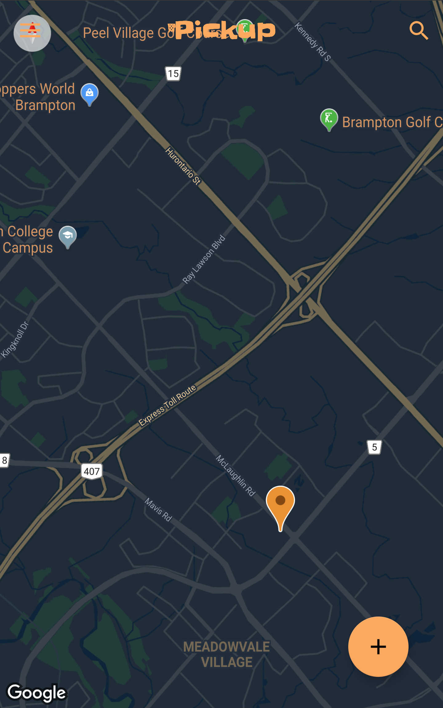

# pickup

## Concept

Pickup is an app that allows you to connect with new people to play pickup basketball with. You can use the app to find nearby basketball pickup games, check their details and add yourself to the list of players showing up to the game. You can also create your own game and fill in all the details so that others can find your game and show up. 

## Technical Details 
Project Pickup is the SOTI intern project for 2017/18. This project involves 2 main components: API, and an Android App coded in native Java. 

The API resides under the backend folder and it uses node, express, and other npm modules. The API uses JWT for authentication purposes, so if you want to deploy the API, you will have to create a secure private key and keep it safe. This means you should not upload the key you are using online anywhere (such as github). 

The Android app is under the frontend folder. The app is set to communciate with an API hosted online. The one that it is currently talking to is only a test environment. If you deploy your own API, you will have to change the app to communciate with that one instead. 

## Developers
* [Abdulqader (Abode) Saafan](https://www.linkedin.com/in/abdulqader-abode-saafan-098807123/)
* [Radhika Krishnan](https://www.linkedin.com/in/radhika-krishnan-141b24110/)
* [Pavle Arezina](https://www.linkedin.com/in/pavle-arezina-40a17b109/)
* [Christian Garcia](https://www.linkedin.com/in/christian-garcia-1b373a103/)
* [Quinn Daneyko](https://www.linkedin.com/in/quinn-daneyko-7742a16b/)

## SOTI
This project was created as an "Intern Project" during the developers' internship term at [SOTI](https://www.soti.net/). 
